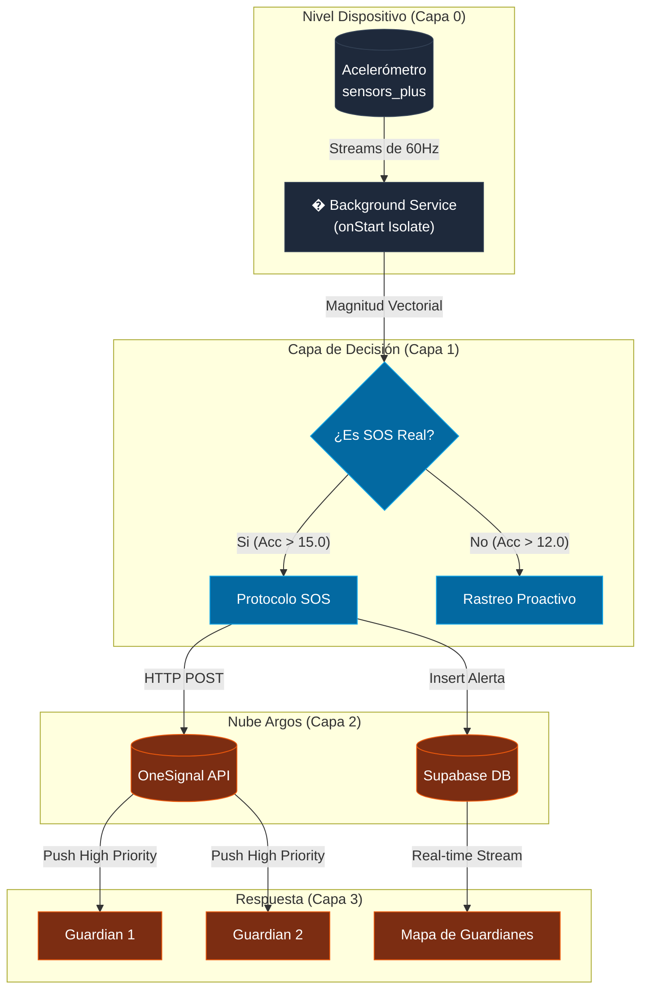

# 🛡️ ARGOS: Manual de Arquitectura y Sistema de Seguridad (v2.8.7.1)

> [!IMPORTANT]
> Este documento es la "Fuente de Verdad" técnica de ARGOS. Explica no solo el **cómo**, sino el **por qué** detrás de cada decisión de ingeniería, desde la detección de sensores hasta el renderizado de vidrio líquido.

---

## �️ 1. Filosofía de Arquitectura: "Atomic Features"

ARGOS no es una app monolítica. Se divide en **Silos de Responsabilidad** para garantizar que un fallo en el mapa no detenga la protección del "Ojo Guardián".

### 📂 Estructura de Directorios Detallada

| Carpeta                       | Rol Técnico               | Componentes Clave                                          |
| :---------------------------- | :------------------------ | :--------------------------------------------------------- |
| `lib/core/`                   | **El Núcleo Atmosférico** | Red, Temas, UI Modular (`GlassBox`), Utilidades.           |
| `lib/features/auth/`          | **Identidad y Seguridad** | Registro, Login, Gestión de Permisos Críticos.             |
| `lib/features/eye_guardian/`  | **El Centinela (24/7)**   | Acelerómetro, Isolate de Fondo, Lógica de Alertas.         |
| `lib/features/family_circle/` | **Red Social de Auxilio** | Gestión de Guardianes, Mapas de Miembros, API del Círculo. |
| `lib/features/sanctuaries/`   | **Navegación Táctica**    | Motor OSRM, Zonas de Peligro, Búsqueda OSM.                |

---

## ⚡ 2. El Ecosistema de Alerta SOS (Deep Dive)

El sistema de alerta es una coreografía perfecta entre hardware y nube.

### 🔄 Diagrama de Flujo de Datos Vitales



---

## ✨ 3. Sistema de Diseño: "Liquid Glass v2"

Nuestra UI no es solo estética; es **funcionalidad emocional**. El uso de `Glassmorphism` reduce la carga cognitiva al mantener el contexto visual del fondo.

### 🎨 Tokens de Diseño
- **Blur**: `25.0 sigma` (Profundidad Atmosférica).
- **Opacidad**: `0.1` a `0.15` (Equilibrio de Visibilidad).
- **Bordes**: `LinearGradient` con brillo en `topLeft`.

> [!TIP]
> El componente `GlassBox` ahora inyecta automáticamente un `BackdropFilter` que purga el renderizado subyacente, optimizando el rendimiento en pantallas OLED.

---

## 📡 4. Integraciones y Servicios Externos

### 🗄️ Supabase (BaaS)
- **Realtime**: Habilitado en las tablas `perfiles` y `alertas`. Permite que los guardianes vean el movimiento del protegido cada 10 metros sin recargar la app.
- **RLS (Row Level Security)**: Las reglas están configuradas para que solo los guardianes vinculados puedan ver la ubicación de sus protegidos.

### 🗺️ Motor de Mapas y Rutas
1. **OSRM (Open Source Routing Machine)**: Calculamos la ruta más rápida.
2. **Análisis de Capas**: Si la ruta pasa por una `Danger Zone` (marcada por una alerta previa), el sistema resta puntos al `Safety Score`.
3. **Nominatim**: Traduce coordenadas GPS a direcciones legibles por humanos.

---

## �️ 5. Guía de Mantenimiento y Evolución

### Cómo añadir una nueva "Feature"
1. Crea una carpeta en `lib/features/nombre_feature`.
2. Define el estado en esa feature.
3. Si requiere comunicación con la nube, añade los métodos a `ApiService`.
4. Registra los UI Components usando `GlassBox` para mantener la fidelidad visual.

### Consideraciones de Rendimiento
- **Battery Optimization**: Se eliminó el plugin invasivo. Ahora usamos instrucciones manuales en `PermissionExplanationScreen` para que Android no "mate" el servicio.
- **Haptics**: Cada acción crítica (SOS, Cancelar) dispara un `HapticFeedback` para comunicación táctil instantánea.

---

### 4. Notificaciones OTA (Over-The-Air)
- **Detección Automática**: El sistema compara la versión local contra la tabla `app_config` de Supabase.
- **Push Broadcast**: Al detectar una nueva versión, ARGOS dispara una notificación Push global vía OneSignal para alertar a todos los dispositivos.
- **Descarga Silenciosa**: Se integra con `ota_update` para facilitar la instalación del nuevo APK sin fricciones.

> [!CAUTION]
> Nunca hagas un deploy con `debugPrint` habilitado en los Isolates, ya que esto consume recursos innecesarios durante el SOS.

```bash
# Versión Actual: 2.8.7+80
# 1. Limpieza
flutter clean
# 2. Obtener dependencias
flutter pub get
# 3. Build para Producción
flutter build apk --split-per-abi --release
```

---
*Este manual es propiedad de **ARGOS PROJECT**. Prohibida su distribución sin autorización. 🛡️✨*
