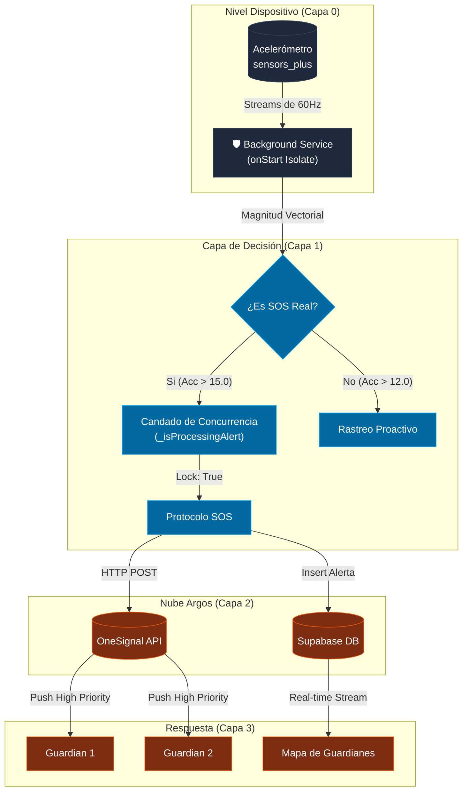

# 🛡️ ARGOS: Manual de Arquitectura y Sistema de Seguridad (v2.15.1)

> [!IMPORTANT]
> Este documento es la "Fuente de Verdad" técnica de ARGOS. Explica no solo el **cómo**, sino el **por qué** detrás de cada decisión de ingeniería, desde la detección de sensores hasta el renderizado de vidrio líquido.

---

## 🏗️ 1. Filosofía de Arquitectura: "Atomic Features"

ARGOS no es una app monolítica. Se divide en **Silos de Responsabilidad** para garantizar que un fallo en el mapa no detenga la protección del "Ojo Guardián".

### 📂 Estructura de Directorios Detallada

| Carpeta                       | Rol Técnico               | Componentes Clave                                          |
| :---------------------------- | :------------------------ | :--------------------------------------------------------- |
| `lib/core/`                   | **El Núcleo Atmosférico** | Red, Temas, UI Modular (`GlassBox`), Utilidades.           |
| `lib/features/auth/`          | **Identidad y Seguridad** | Registro, Login, Gestión de Permisos Críticos.             |
| `lib/features/eye_guardian/`  | **El Centinela (24/7)**   | Acelerómetro, Isolate de Fondo, Lógica de Alertas.         |
| `lib/features/family_circle/` | **Red Social de Auxilio** | Gestión de Guardianes, Mapas de Miembros, API del Círculo. |
| `lib/features/routes/`        | **Navegación Táctica**    | Motor OSRM, Zonas de Peligro, Búsqueda OSM.                |

---

## ⚡ 2. El Ecosistema de Alerta SOS (Deep Dive)

El sistema de alerta es una coreografía perfecta entre hardware y nube.

### 🔄 Protocolo de Seguridad Blindado (v2.15.1)
En la versión 2.15.1, el protocolo SOS se ha reforzado con **Navigation Locks**:
- **PopScope Blocking**: Las pantallas `AlertConfirmationScreen` e `IncidentClassificationScreen` ahora bloquean el botón físico/gestual de retroceso. El usuario **debe** clasificar el incidente o cancelar la alerta explícitamente.
- **Mandatory Classification**: Se eliminó la opción de "Omitir" en la clasificación de incidentes para forzar la recolección de datos que alimentan las zonas de peligro comunitarias.

### 🔄 Diagrama de Flujo de Datos Vitales



---

## ✨ 3. Sistema de Diseño: "Liquid Glass v2"

Nuestra UI no es solo estética; es **funcionalidad emocional**. El uso de `Glassmorphism` reduce la carga cognitiva al mantener el contexto visual del fondo.

### 🎨 Optimización de Visibilidad (v2.15.1)
Se han ajustado los tokens de diseño para garantizar accesibilidad en **Modo Claro**:
- **Contrast enhancement**: El texto "ESTADO: PROTEGIDO" y "MODO TRAVESÍA" ahora utilizan `emeraldGreen` y `argosRed` respectivamente para destacar sobre fondos claros.
- **Glass Definition**: Se incrementó la opacidad (`0.12`) y el contraste del borde en `GlassBox` cuando se detecta `Brightness.light`.

---

## 📡 4. Integraciones y Servicios Externos

### 🗄️ Supabase (BaaS)
- **Realtime**: Habilitado en las tablas `perfiles` y `alertas`.
- **Anti-Spam Logic**: El servicio de fondo ahora utiliza un timestamp persistente para imponer un cooldown de 3 minutos entre alertas SOS automáticas.

### 🗺️ Motor de Mapas y Rutas
1. **OSRM (Open Source Routing Machine)**: Calculamos la ruta más rápida.
2. **Análisis de Capas**: Si la ruta pasa por una `Danger Zone`, el sistema resta puntos al `Safety Score`.

---

## 🛠️ 5. Guía de Mantenimiento y Evolución

### Cómo añadir una nueva "Feature"
1. Crea una carpeta en `lib/features/nombre_feature`.
2. Define el estado en esa feature.
3. Si requiere comunicación con la nube, añade los métodos a `ApiService`.

### Consideraciones de Rendimiento
- **Concurrency Control**: Siempre usa flags booleanos (`_isProcessingAlert`) en los Isolates de fondo para evitar carreras de datos (Race Conditions).

---

### 🚀 Despliegue y Versión
- **Versión Actual**: 2.15.1+110
- **Build**: Siempre usar `--split-per-abi` para minimizar el tamaño del APK descargado vía OTA.

```bash
# Versión Actual: 2.15.1+110
# 1. Limpieza
flutter clean
# 2. Obtener dependencias
flutter pub get
# 3. Build para Producción
flutter build apk --split-per-abi --release
```

---
*Este manual es propiedad de **ARGOS PROJECT**. Prohibida su distribución sin autorización. 🛡️✨*
